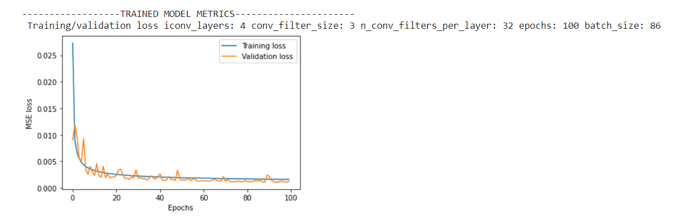
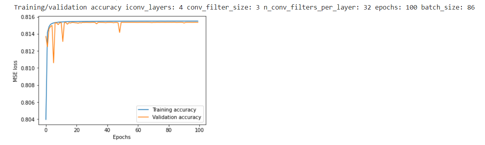
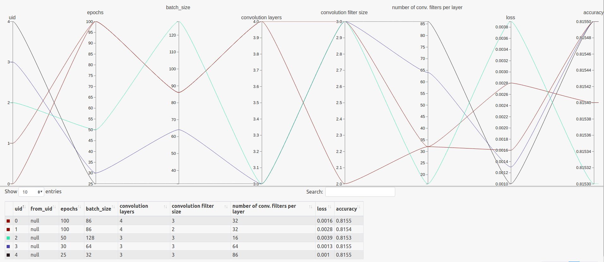
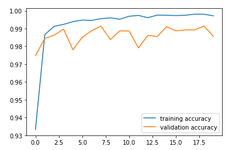
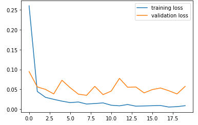
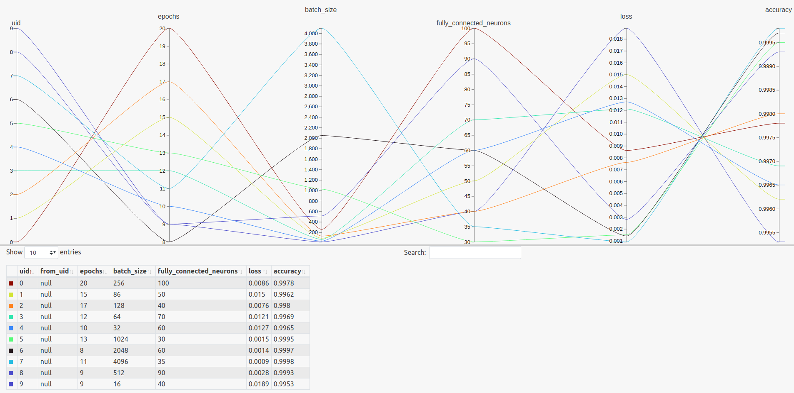
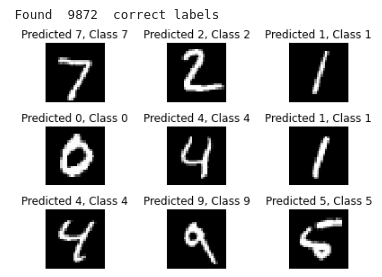
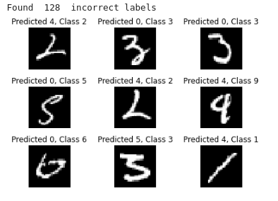

# Neural Networks for Autoencoding and Classifying Images

The goal of this project is to create 2 types of Neural Network models:
 - An image auto-encoder model.
 - An image classification model.

The **auto-encoder** model consists of two different types of layers: the encoding and the decoding layers. The program created is a handy interface in order for the user to insert different values of several hyper-parameters and see the behavior of each model, with ultimate goal to chose one model that best handles the dataset given.

The **classification** model aims to classifying images in a category. To do so, it uses a pre-trained auto-encoder model, by taking advantage of its encoding layers, which are then connected to a fully connected layer, and then to an output one, aiming to the best possible classification of the images. Once again, multiple models can be trained, in order for the user to decide the best for the training set needs, and then, the best one will be used in order to predict the test dataset.

## Compiling and Running

In order to run the Autoencoder model, you should navigate to the directory Autoencoder, and run the file [autoencoder.py](Autoencoder/autoencoder.py), as following:

```python autoencoder.py −d <trainingset>```

In order to run the classifier model, you should navigate to the directory classifier, and run the file [classification.py](Classifier/classification.py), as following:

```python classification.py −d <trainingset> −dl <traininglabels> −t <testset> − tl <testlabels> −model <autoencoderh5>```

## Implementation

Specifics of our code implementation can be found under the [README.pdf](README.pdf) file.

## Model Results

Some sample results from our experiments in the models are the following:

### Autoencoder
                            Accuracy Plot:


                                Error Plot:


We also created a high dimensional plot in order to visualze the accuracy and the loss for our best models, using HiPlot.




### Autoencoder
                            Accuracy Plot:


                                Error Plot:


The hiplot created for our best classification models is the following:


## Classification outcome

The result of the predictions from our best model(accuracy 99%), are the following

### Correctly Predicted Images

### Incorectly Predicted Images



## License

This project is licensed under the MIT License - see the [LICENSE](/LICENCE) file for details

## Contributors

[Nikos Galanis](https://github.com/nikosgalanis) \
[Sofoklis Strompolas](https://github.com/SofoSt/)